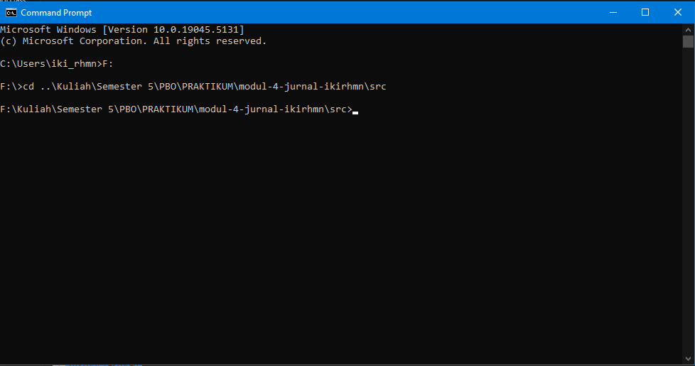
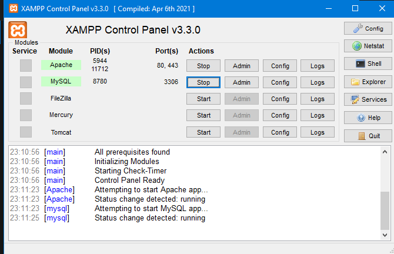
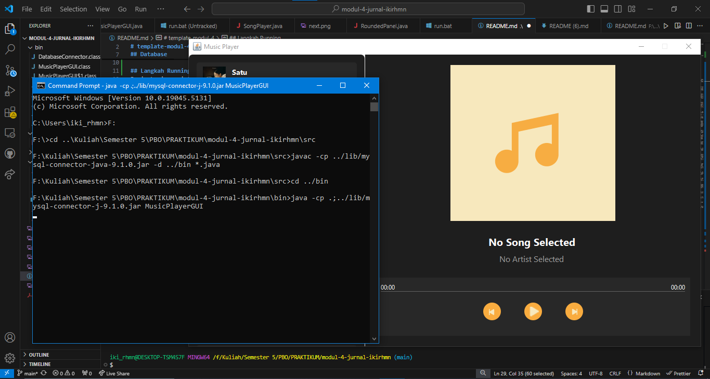
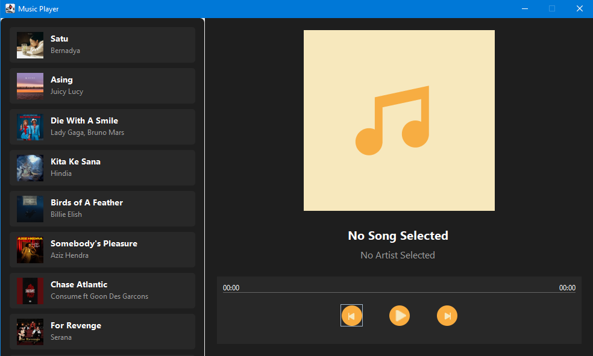
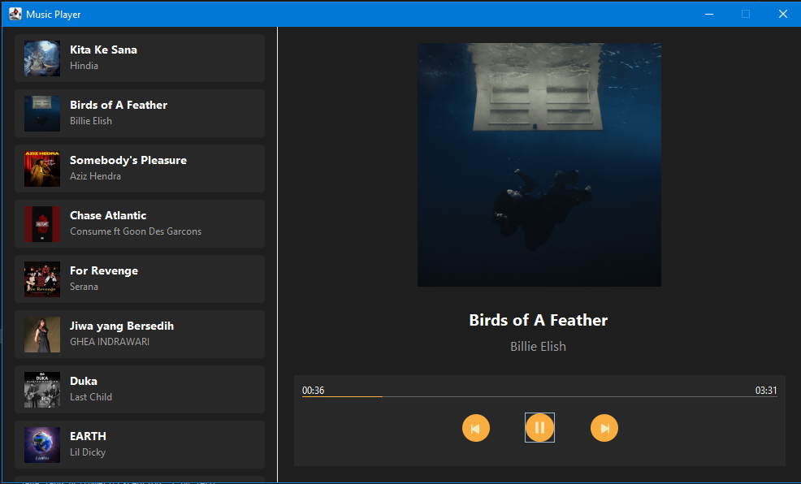
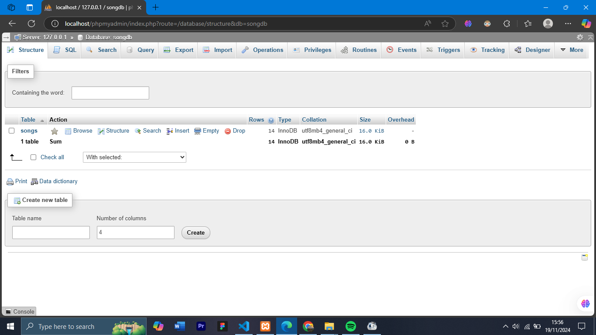

[](https://classroom.github.com/a/uNKms28e)

# PROYEK MODUL 4 - MusicPlayer

## Deskripsi
MusicPlayer merupakan sebuah project java, yang dimana menerapkan beberapa konsep **GUI,Thread**, dan **JDBC**. **Thread** adalah unit eksekusi terkecil dalam sebuah program yang berjalan secara independen. Di Java, thread memungkinkan multitasking, seperti menjalankan tugas-tugas paralel (contohnya, memperbarui UI dan memutar musik secara bersamaan). Pada aplikasi ini, thread digunakan untuk memperbarui progress bar secara real-time tanpa membuat antarmuka menjadi tidak responsif. Ini meningkatkan pengalaman pengguna dengan menjaga kelancaran interaksi selama musik diputar.


## Konsep Utama dan Method-method yang Digunakan
1. **DatabaseConnector** : Menyediakan koneksi ke database MySQL melalui metode getConnection(), menyederhanakan pengelolaan koneksi database.
2. **MusicPlayerGUI** : Antarmuka grafis untuk pemutar musik menggunakan Java Swing, mencakup panel daftar lagu, kontrol pemutaran, dan progres bar.
3. **loadSongsFromDatabase** : Memuat daftar lagu dari database, menambahkannya ke songListPanel dengan elemen grafis untuk setiap lagu.
4. **createSongItemPanel** : Membuat panel lagu dengan tampilan thumbnail, judul, dan artis, serta aksi untuk memperbarui detail lagu yang dipilih.
5. **startProgressThread** : Thread untuk memperbarui progres bar pemutaran lagu secara berkala hingga lagu selesai diputar.
6. **togglePlay** : Mengontrol pemutaran lagu, memulai atau menghentikan audio, dan memperbarui UI tombol play/pause.
7. **playNextSong** / playPreviousSong : Memutar lagu berikutnya atau sebelumnya dalam daftar secara melingkar.
8. **createSongDetailPanel** : Membuat panel detail lagu dengan thumbnail, informasi lagu, progres bar, dan kontrol pemutaran.
9. **updateSongDetails** : Memperbarui informasi lagu di UI ketika lagu dipilih, menghentikan audio sebelumnya, dan memuat file baru.
10. **RoundedPanel** : Panel dengan sudut melengkung menggunakan fillRoundRect untuk desain UI yang modern.
11. **Song** : Model data lagu dengan atribut seperti id, title, artist, songPath, dan thumbnailPath.
12. **SongPlayer** : Mengelola pemutaran audio dengan API javax.sound.sampled melalui metode play, stop, dan isPlaying.


## Struktur Proyek

```
.
MODUL-4
├── bin/                             # Folder hasil kompilasi terminal
│   ├── DatabaseConnector.class
│   ├── MusicPlayerGUI.class
│   ├── MusicPlayerGUI$1.class
│   ├── MusicPlayerGUI$2.class
│   ├── RoundedPanel.class
│   ├── Song.class
│   └── SongPlayer.class
├── lib/                             # Dependensi eksternal/Database connector
│   └── mysql-connector-j-9.1.jar
├── res/                             # Folder resources
│   ├── fonts/                       # Font untuk antarmuka
│   ├── images/                      # Gambar untuk thumbnail music di GUI
│   │   ├── image-1.png
│   │   ├── image-2.png
│   │   ├── image-3.png
│   │   ├── image-4.png
│   │   └── image-5.png
│   └── music/     
│       ├── music-1.wav              # Lagu-lagu untuk pemutar musik
│       ├── music-2.wav
│       ├── music-3.wav
│       ├── music-4.wav
│       └── music-5.wav              
├── src/                             # Folder kode sumber (source code)
│   ├── DatabaseConnector.java
│   ├── MusicPlayerGUI.java
│   ├── RoundedPanel.java
│   ├── Song.java
│   └── SongPlayer.java
├── README.md                        # Dokumentasi proyek
├── run.bat                          # Skrip batch untuk menjalankan aplikasi
└── Soal Jurnal.pdf                  # Soal atau instruksi terkait proyek

```


## Langkah Running
Baris-baris perintah di bawah adalah langkah-langkah untuk mengompilasi dan menjalankan program Java dengan library eksternal, dalam hal ini MySQL Connector. Perintah ini dilakukan di terminal cmd

- Buka Terminal CMD



- Nyalakan XAMPP



- Ketik perintah di CMD `cd ..\Kuliah\Semester 5\PBO\PRAKTIKUM\modul-4-jurnal-ikirhmn\src`


- (**harus di src dulu**) kemudian ketik `javac -cp ../lib/mysql-connector-java-9.1.0.jar -d ../bin *.java`

- Lalu pindah ke folder bin dengan mengetik `cd ../bin`

- (**harus di bin dulu**) terakhir `java -cp .;../lib/mysql-connector-j-9.1.0.jar MusicPlayerGUI`

- Jika tidak ada error maka akan langsung memunculkan GUI dari MusicPlayer



- Note : jika sudah melakukan step terminal diatas sampe akhir, selanjutnya dan seterusnya tidak perlu run melalui terminal, cukup di `run.bat`


# Gambar Hasil Run Yang Diinginkan

Gambar diatas merupakan tampilan awal saat running code ketika pertama kali dijalankan. Tidak ada lagu yang dipilih, sehingga di bagian kanan aplikasi terlihat teks "No Song Selected" dan "No Artist Selected".


Gambar diatas merupaakan kondisi aplikasi ketika sebuah lagu sedang dimainkan.

# Gambar Database

Gambar diatas berupa tampilan dari database `songdb` yang berisi tabel songs

.png>)
Gambar diatas berupa tampilan dari atribut-atribut dari tabel songs. Disana juga tertampil data-data yang sudah diinput di database yang nantinya akan jadi isi konten dari GUI MusicPlayer